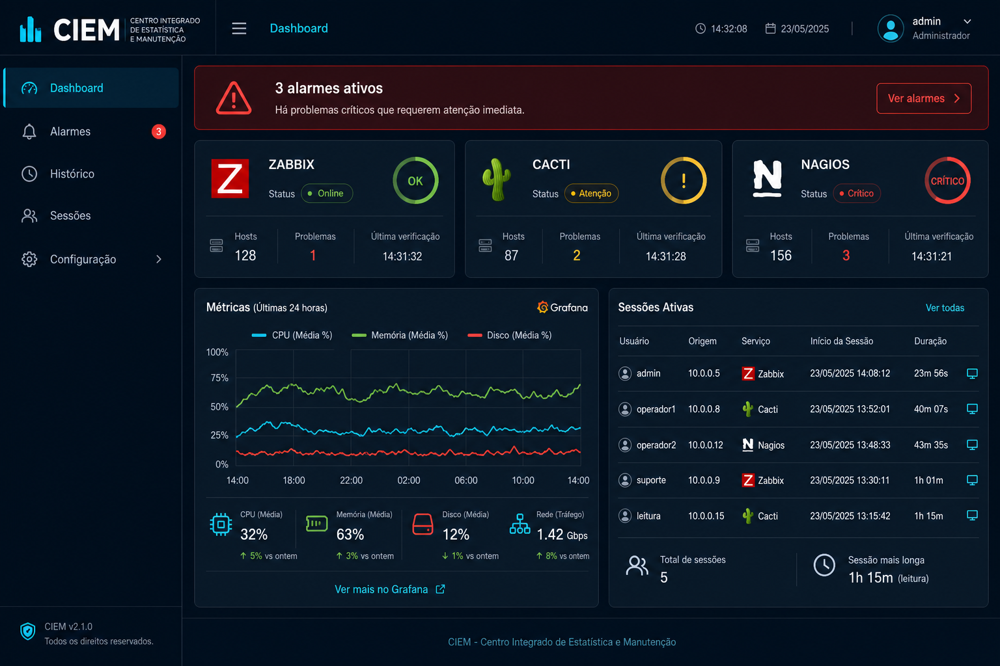

# CIEM — Centro Integrado de Estatística e Manutenção

[](https://github.com/rodrigo-rezende/ciem/actions/workflows/ci.yml)

Plataforma **ZTNA** (Zero Trust Network Access) para manutenção administrativa de redes — servidores, roteadores e switches. O CIEM agrega informações de sistemas de monitoramento, chamados e e-mail de suporte, apresentando tudo em um portal unificado com Grafana e sessões remotas auditadas via Guacamole.



## Principais recursos

- **ZTNA** — acesso seguro à rede de gerência com SSL (certificado wildcard)
- **Módulos isolados** — Zabbix, Cacti, Nagios, TOPdesk, Inventory, Syslog (cada um em container/pod separado)
- **Grafana** — alarmes ativos em destaque + histórico separado
- **Guacamole** — sessões SSH/RDP/VNC registradas (quem, quando, comandos, duração)
- **Autenticação** — usuários locais (observer/admin) ou LDAP
- **Deploy flexível** — Docker Compose, Kubernetes ou Rancher


## Início rápido

### Pré-requisitos

- Docker Compose v2 (ou Kubernetes 1.25+)
- Certificado wildcard SSL (para produção)

### 1. Clonar e configurar

```bash
git clone https://github.com/rodrigo-rezende/ciem.git
cd ciem
cp .env.example .env
```

### 2. Editar configuração

```bash
# Habilitar módulos desejados
nano config/modules.yaml

# Configurar autenticação
nano config/auth.yaml

# Definir alvos de manutenção (SSH/RDP)
nano config/targets.yaml
```

### 3. Subir a plataforma

```bash
# Mínimo: core + portal + proxy
docker compose -f deploy/docker/docker-compose.yml --profile core up -d --build

# Com módulos e Grafana
docker compose -f deploy/docker/docker-compose.yml --profile core --profile modules --profile grafana up -d --build

# Tudo habilitado
docker compose -f deploy/docker/docker-compose.yml --profile full up -d --build
```

### 4. Acessar

| Serviço | URL | Credenciais padrão |
|---------|-----|-------------------|
| Portal CIEM | https://localhost/ | admin / admin123 |
| Grafana | https://localhost/grafana/ | admin / admin |
| API Core | https://localhost/api/health | — |

> **Altere as senhas padrão imediatamente em produção!**

## Arquitetura

```
┌─────────────┐     ┌──────────────┐     ┌─────────────────────────────┐
│   Proxy     │────▶│  CIEM Core   │────▶│  Módulos (isolados)         │
│  (SSL/TLS)  │     │  (API ZTNA)  │     │  Zabbix │ Cacti │ Nagios   │
└──────┬──────┘     └──────────────┘     │  TOPdesk│ Invent│ Syslog   │
       │                                  └─────────────────────────────┘
       ├────▶ Portal (configuração)
       ├────▶ Grafana (visualização)
       └────▶ Guacamole (sessões SSH/RDP)
```

Cada componente roda em **container/pod isolado** para contenção e segurança.

## Estrutura do projeto

```
config/                  # Configuração YAML (comentada em português)
  main.yaml              # Configuração global
  modules.yaml           # Módulos coletores (ativar/desativar)
  auth.yaml              # Usuários locais e LDAP
  targets.yaml           # Alvos de manutenção (SSH/RDP)
services/
  core/                  # API central CIEM
  portal/                # Interface web
  proxy/                 # Proxy reverso SSL
  modules/               # Coletores isolados
    zabbix/ cacti/ nagios/ topdesk/ inventory/ syslog/
shared/ciem_common/      # Biblioteca compartilhada
deploy/
  docker/                # Docker Compose com perfis
  kubernetes/            # Manifests K8s
  rancher/               # Catálogo Rancher
grafana/                 # Dashboards provisionados
docs/                    # Documentação completa
```

## Documentação

| Documento | Conteúdo |
|-----------|----------|
| [ARCHITECTURE.md](docs/ARCHITECTURE.md) | Arquitetura, módulos e comunicação |
| [CONFIGURATION.md](docs/CONFIGURATION.md) | Guia completo de configuração |
| [MODULES.md](docs/MODULES.md) | Módulos coletores (Zabbix, Cacti, etc.) |
| [AUTH.md](docs/AUTH.md) | Autenticação local e LDAP |
| [MAINTENANCE.md](docs/MAINTENANCE.md) | Sessões SSH/RDP via Guacamole |
| [DEPLOYMENT.md](docs/DEPLOYMENT.md) | Docker, Kubernetes e Rancher |
| [CI_CD.md](docs/CI_CD.md) | Pipelines GitHub Actions |

## Módulos coletores

Cada módulo é **independente** — ative apenas os que precisa em `config/modules.yaml`:

| Módulo | Fonte | Dados coletados |
|--------|-------|-----------------|
| **zabbix** | Zabbix API | Hosts, triggers, problemas ativos |
| **cacti** | Cacti web | Dispositivos, gráficos |
| **nagios** | Nagios XI API | Status de hosts e serviços |
| **topdesk** | TOPdesk API | Chamados abertos e histórico |
| **inventory** | API REST genérica | Inventário de ativos |
| **syslog** | Syslog/REST | Eventos de syslog |

## Autenticação

| Papel | Permissões |
|-------|-----------|
| **observer** | Visualiza dashboards, alarmes e histórico |
| **admin** | Configura módulos, inicia sessões de manutenção, gerencia usuários |

Suporte a **LDAP/Active Directory** — veja [docs/AUTH.md](docs/AUTH.md).

## Desenvolvimento

```bash
pip install -r requirements-dev.txt
export PYTHONPATH=shared:services/core
export CONFIG_PATH=./config
ruff check shared services/core tests
pytest tests -v
```

## Licença

MIT — veja [LICENSE](LICENSE).
