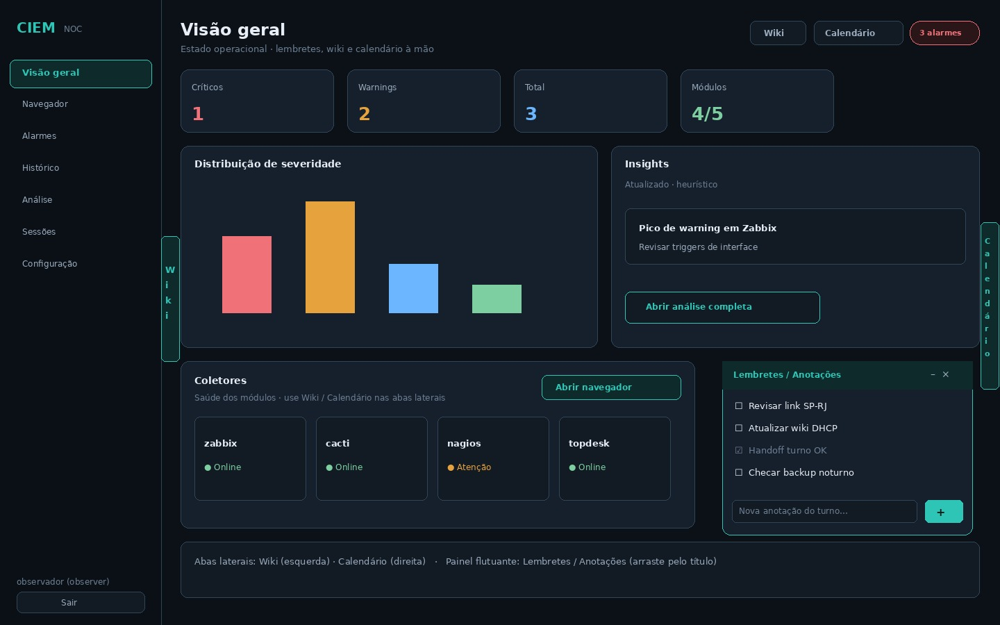
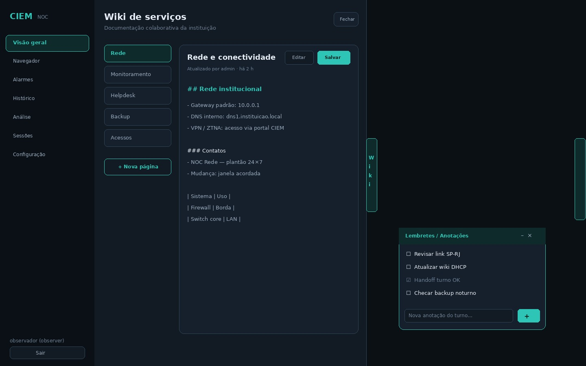
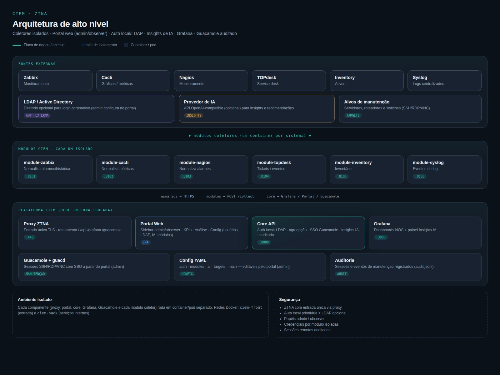

# CIEM — Centro Integrado de Estatística e Manutenção

[](https://github.com/avilarezende/ciem/actions/workflows/ci.yml)

Plataforma **ZTNA** para manutenção de redes: agrega Zabbix, Cacti, Nagios, TOPdesk, inventário e syslog em um portal unificado, com **Navegador HTML5** embutido, Grafana, sessões remotas auditadas via Guacamole, autenticação local/LDAP e insights opcionais de IA.

> **Versão atual (`main`):** portal ergonômico + **Navegador HTML5**, **Lembretes/Anotações**, **Calendário** compartilhado e **Wiki** de serviços, com **autenticação por token assinado (HMAC-SHA256)**, rate limiting na API e varredura de segurança na CI.





## Funções do portal (administração)

| Função | Quem configura | Quem consome |
|--------|----------------|--------------|
| **Usuários locais** + admin padrão | Admin | Todos (login) |
| **LDAP / Active Directory** (opcional) | Admin | Usuários do diretório |
| **Navegador HTML5** (Grafana, URLs, SSO) | — (disponível a todos) | Todos; admin também Guacamole/módulos |
| **Lembretes / Anotações** (painel arrastável) | — (local no navegador) | Todos |
| **Calendário** (aba deslizante Google/Microsoft) | Usuário (URL de incorporação) | Todos |
| **Wiki de serviços** (Markdown colaborativo) | Todos editam; admin exclui | Todos |
| **Módulos coletores** (switch + URL/credenciais) | Admin | Todos (alarmes/dashboards) |
| **Insights de IA** (URL, API key, modelo) | Admin | Todos, quando habilitado |
| **Sessões Guacamole** + auditoria | Admin | Admin (navegador ou nova aba) |

Resumo das novidades: [docs/CHANGELOG_FEATURES.md](docs/CHANGELOG_FEATURES.md) · Auth: [docs/AUTH.md](docs/AUTH.md) · Segurança OWASP: [docs/OWASP.md](docs/OWASP.md) · IA: [docs/AI.md](docs/AI.md)

## Comece aqui

| Eu quero… | Documento |
|-----------|-----------|
| **Subir pela primeira vez** | [docs/GETTING_STARTED.md](docs/GETTING_STARTED.md) |
| **Usar o portal (observer)** | [docs/MANUAL_USER.md](docs/MANUAL_USER.md) |
| **Administrar o portal** | [docs/MANUAL_ADMIN.md](docs/MANUAL_ADMIN.md) |
| **Fluxo diário NOC** | [docs/USAGE.md](docs/USAGE.md) |
| **Configurar LDAP / usuários** | [docs/AUTH.md](docs/AUTH.md) |
| **Ativar insights de IA** | [docs/AI.md](docs/AI.md) |
| **Deploy em Kubernetes** | [docs/KUBERNETES.md](docs/KUBERNETES.md) → [`deploy/kubernetes/`](deploy/kubernetes/README.md) |
| **Entender dashboards Grafana** | [docs/DASHBOARDS.md](docs/DASHBOARDS.md) |
| **Ver fluxos (coleta, SSO, auditoria)** | [docs/PROCESSES.md](docs/PROCESSES.md) |
| **Desenvolver o portal (mockups)** | [docs/PORTAL.md](docs/PORTAL.md) |
| **Índice completo** | [docs/README.md](docs/README.md) |

## Início rápido (Docker)

```bash
git clone https://github.com/avilarezende/ciem.git
cd ciem
cp .env.example .env

# Gere e configure as chaves OBRIGATÓRIAS antes de subir (o core não inicia
# sem CIEM_SECRET_KEY forte — fail-fast):
openssl rand -hex 32          # CIEM_SECRET_KEY    (assina tokens de sessão/SSO)
openssl rand -hex 32          # CIEM_GRAFANA_TOKEN (senha interna do Grafana)
# edite o .env e preencha CIEM_SECRET_KEY e CIEM_GRAFANA_TOKEN com as chaves geradas

# Opcional: edite config/*.yaml — ou configure pelo portal após o login admin
# (módulos, LDAP, usuários locais, provedor de IA)

docker compose -f deploy/docker/docker-compose.yml --profile core --profile modules --profile grafana up -d --build
```

| Serviço | URL | Dev |
|---------|-----|-----|
| Portal | `https://localhost/` | Senha do `admin` **rotacionada** — defina em `config/auth.yaml` ou no portal |
| Grafana | `https://localhost/grafana/` | `admin` / `admin` (troque via `GRAFANA_ADMIN_PASSWORD`) |
| API | `https://localhost/api/health` | — |

> **Segurança:** o login devolve um **token assinado (HMAC-SHA256)** válido por 8 h (`CIEM_SESSION_TTL` para ajustar). O core **não inicia** (fail-fast) se `CIEM_SECRET_KEY` não estiver configurada ou estiver no valor padrão (`change-me...`). Mais em [docs/AUTH.md](docs/AUTH.md).

Após o login: sidebar **Navegador** (Grafana/URLs embutidos). Admin também usa **Configuração** (Usuários, LDAP, IA, Módulos) e **Sessões** (Guacamole no navegador ou nova aba). Operadores usam **Visão geral** e **Análise** para KPIs, gráficos e insights.

## Início rápido (Kubernetes)

```bash
kubectl apply -f deploy/kubernetes/00-namespace.yaml
# Configure ConfigMap e Secrets — ver docs/KUBERNETES.md.
# Obrigatório nos Secrets: CIEM_SECRET_KEY e CIEM_GRAFANA_TOKEN (gere com openssl rand -hex 32)
kubectl apply -f deploy/kubernetes/
```

YAML numerados (`00`–`09`): namespace, config, secrets, core, portal, módulos, Grafana, Guacamole, storage, ingress.

## Mockups do portal (times e versionamento)

Referência visual em `docs/assets/` para alinhar produto, UX e desenvolvimento:

| Imagem | Tela |
|--------|------|
| [login](docs/assets/ciem-portal-login.jpg) | Autenticação (brand-first) |
| [dashboard](docs/assets/ciem-portal-dashboard.jpg) | Visão geral com **Lembretes**, abas **Wiki** e **Calendário** |
| [lembretes](docs/assets/ciem-portal-reminders.jpg) | **Lembretes / Anotações** flutuantes (arrastáveis) |
| [calendário](docs/assets/ciem-portal-calendar.jpg) | **Calendário** deslizante (Google/Microsoft) |
| [wiki](docs/assets/ciem-portal-wiki.jpg) | **Wiki** deslizante de serviços da instituição |
| [navegador](docs/assets/ciem-portal-browser.jpg) | Navegador HTML5 (Grafana/URLs embutidos) |
| [alarmes](docs/assets/ciem-portal-alarms.jpg) | Alarmes ativos |
| [análise](docs/assets/ciem-portal-analysis.jpg) | Análise (abas + gráfico) |
| [sessões](docs/assets/ciem-portal-sessions.jpg) | Guacamole no navegador ou nova aba |
| [configuração](docs/assets/ciem-config-interface.png) | Configuração por seções (admin) |
| [arquitetura](docs/assets/ciem-architecture-diagram.jpg) | Fluxo ZTNA (Portal + Navegador) |

## Arquitetura



Cada componente (core, portal, módulos, Grafana, Guacamole) roda em **container/pod isolado**. Detalhes: [docs/ARCHITECTURE.md](docs/ARCHITECTURE.md).

## Documentação

| Área | Documentos |
|------|----------------|
| **Configuração** | [CONFIGURATION.md](docs/CONFIGURATION.md), [AUTH.md](docs/AUTH.md), [OWASP.md](docs/OWASP.md), [AI.md](docs/AI.md) |
| **Deploy** | [DEPLOYMENT.md](docs/DEPLOYMENT.md), [KUBERNETES.md](docs/KUBERNETES.md), [CI_CD.md](docs/CI_CD.md) |
| **Operação** | [USAGE.md](docs/USAGE.md), [PROCESSES.md](docs/PROCESSES.md), [MAINTENANCE.md](docs/MAINTENANCE.md) |
| **Visualização** | [DASHBOARDS.md](docs/DASHBOARDS.md), [GRAFANA.md](docs/GRAFANA.md) |
| **Desenvolvimento** | [PORTAL.md](docs/PORTAL.md), [MODULES.md](docs/MODULES.md) |
| **Novidades** | [CHANGELOG_FEATURES.md](docs/CHANGELOG_FEATURES.md) |

## Módulos coletores

Ative em `config/modules.yaml` **ou** no portal (**Configuração → Módulos coletores**): switch + URL/credenciais.

| Módulo | Fonte |
|--------|-------|
| zabbix | Zabbix API |
| cacti | Cacti web |
| nagios | Nagios XI |
| topdesk | TOPdesk API |
| inventory | API REST |
| syslog | Arquivo / API |

> Os módulos usam `use_mock_on_failure: false` por padrão — **dados simulados não são mais fallback silencioso**; falha de coleta vira erro/status OFFLINE. O `CONFIG_PATH` aceita **arquivo** (`config.yaml`) ou **diretório** (procura `modules.yaml` e extrai `modules.<nome>.options`). Detalhes: [docs/CONFIGURATION.md](docs/CONFIGURATION.md) e [docs/MODULES.md](docs/MODULES.md).

## Desenvolvimento

```bash
pip install -r requirements-dev.txt
export PYTHONPATH=shared:services/core CONFIG_PATH=./config
export CIEM_SECRET_KEY="$(openssl rand -hex 32)"
export CIEM_GRAFANA_TOKEN="$(openssl rand -hex 32)"
# CIEM_RATE_LIMIT_ENABLED=0 desativa o rate limiting local (padrão usado nos testes)
ruff check shared services/core services/modules tests
pytest tests -v
```

## Licença

MIT — [LICENSE](LICENSE).

## Ambiente na nuvem

Instalação, locks, diagnóstico e separação desenvolvimento/produção estão documentados em
[`antigravity-config/cloud/README.md`](../antigravity-config/cloud/README.md) no workspace com os sete checkouts.
No GitHub: [guia do ambiente](https://github.com/avilarezende/antigravity-config/blob/main/cloud/README.md).
