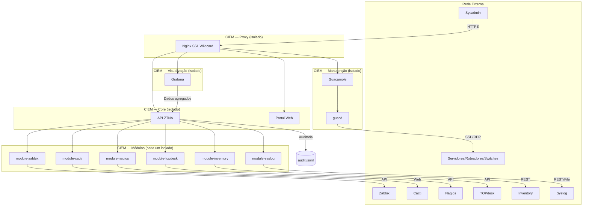

# Arquitetura do CIEM

## Visão geral

O **CIEM** (Centro Integrado de Estatística e Manutenção) é uma plataforma ZTNA que combina:

1. **Coleta** — dados de sistemas de monitoramento existentes (sem dependência do CIEM)
2. **Visualização** — Grafana com alarmes ativos em destaque e histórico separado
3. **Manutenção** — sessões SSH/RDP/VNC via Guacamole com auditoria completa

## Princípio de isolamento

> Cada sistema suportado roda em **container/pod separado**, assim como o core, o proxy e o Guacamole.

Isso garante:
- **Contenção** — falha em um módulo não afeta os demais
- **Segurança** — credenciais de cada sistema ficam isoladas
- **Flexibilidade** — ative apenas os módulos necessários


## Componentes



## Fluxo de dados

### 1. Coleta (módulos → core)

```
Sistema externo → Módulo coletor → POST /collect → Core API → Grafana
```

- Cada módulo consulta a interface web/API do sistema externo
- Retorna JSON normalizado: `active_alarms[]` + `history_events[]`
- O core agrega dados de todos os módulos habilitados

### 2. Visualização (Grafana)

- **Alarmes ativos** — banner vermelho no portal + painel dedicado no Grafana
- **Histórico** — painel separado com eventos passados
- Dashboards provisionados automaticamente em `grafana/dashboards/`

### 3. Manutenção (Guacamole → alvos)

```
Admin → Portal → Core API → Guacamole → guacd → Equipamento
                                    ↓
                              audit.jsonl (sessão registrada)
```

Cada sessão registra:
- Quem acessou (usuário)
- Quando (data/hora início e fim)
- O quê (comandos executados)
- Quanto tempo (duração em segundos)
- Para onde (hostname/IP do alvo)

## Redes Docker

| Rede | Acesso | Serviços |
|------|--------|----------|
| `ciem-front` | Externa (via proxy) | proxy, portal |
| `ciem-back` | Interna (isolada) | core, módulos, grafana, guacamole |

## Decisões de design

| Decisão | Motivo |
|---------|--------|
| Módulos sem dependência entre si | Ativar/desativar sem impacto |
| Configuração via YAML comentado | Flexível para qualquer cliente |
| Proxy em instância separada | Terminação SSL centralizada |
| Coleta direta dos sistemas existentes | CIEM não substitui monitoramento |
| Sem vínculo organizacional | Configuração livre por IP/domínio |

## Portas internas

| Serviço | Porta | Rede |
|---------|-------|------|
| ciem-core | 8000 | ciem-back |
| ciem-portal | 80 | ciem-front/back |
| ciem-proxy | 80, 443 | ciem-front |
| grafana | 3000 | ciem-back |
| guacamole | 8080 | ciem-back |
| module-zabbix | 8101 | ciem-back |
| module-cacti | 8102 | ciem-back |
| module-nagios | 8103 | ciem-back |
| module-topdesk | 8104 | ciem-back |
| module-inventory | 8105 | ciem-back |
| module-syslog | 8106 | ciem-back |
