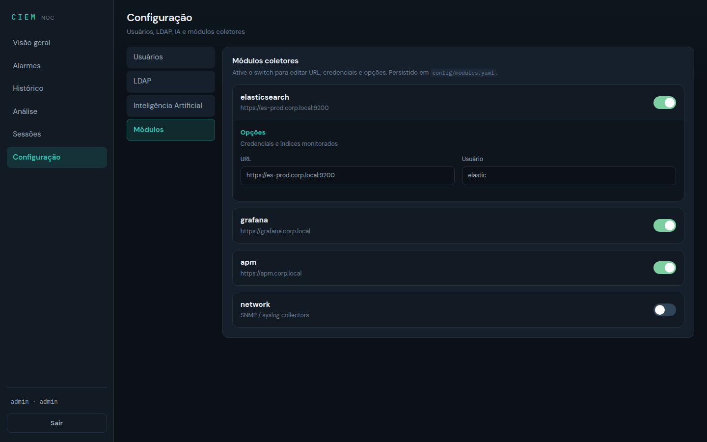

# Configuração do CIEM



O CIEM é configurado via arquivos YAML comentados em português, localizados em `config/`. Não há vínculo com organizações específicas — configure IPs, domínios e credenciais do seu ambiente.

## Arquivos de configuração

| Arquivo | Função | Reinício necessário |
|---------|--------|-------------------|
| `config/main.yaml` | Configuração global (proxy, grafana, guacamole) | Sim |
| `config/modules.yaml` | Ativar/desativar módulos coletores | Sim* |
| `config/auth.yaml` | Usuários locais e LDAP | Sim* |
| `config/ai.yaml` | Provedores de IA / insights | Não (cache invalidado na API) |
| `config/targets.yaml` | Alvos de manutenção (SSH/RDP) | Não |

\* Alterações via portal são aplicadas na hora na API; reinício garante que outros processos releiam o YAML.

Documentação de IA: [AI.md](AI.md).

## Variáveis de ambiente obrigatórias

O `ciem-core` **não inicia** (fail-fast) se `CIEM_SECRET_KEY` não estiver definida ou estiver no valor padrão (`change-me...`). Em Docker/Kubernetes, `CIEM_SECRET_KEY` e `CIEM_GRAFANA_TOKEN` são **obrigatórias** no ambiente.

Gere chaves fortes:

```bash
openssl rand -hex 32   # CIEM_SECRET_KEY
openssl rand -hex 32   # CIEM_GRAFANA_TOKEN
```

| Variável | Obrigatória | Função |
|----------|-------------|--------|
| `CIEM_SECRET_KEY` | Sim (core) | Assina tokens de sessão (login) e SSO via HMAC-SHA256 |
| `CIEM_GRAFANA_TOKEN` | Sim (Docker/K8s) | Senha interna de integração core ↔ Grafana |
| `CIEM_SESSION_TTL` | Não | Validade do token de sessão em segundos (padrão `28800` = **8 h**) |
| `CIEM_SSO_TTL` | Não | Validade do token SSO do Guacamole (padrão `300` s) |
| `CIEM_RATE_LIMIT_ENABLED` | Não | `0` desativa o rate limiting (útil em testes); ativo por padrão |
| `GRAFANA_ADMIN_USER` / `GRAFANA_ADMIN_PASSWORD` | Não | Credenciais de login do painel Grafana |

> No `deploy/docker/docker-compose.yml` as duas primeiras usam `${CIEM_SECRET_KEY:?...}` — sem elas, `docker compose up` **falha na hora**. Autenticação e limites por endpoint: [AUTH.md](AUTH.md).

## config/main.yaml

```yaml
platform_name: "CIEM"           # Nome exibido no portal
environment: production          # production | staging | development
log_level: INFO                  # DEBUG | INFO | WARNING | ERROR
collection_interval_seconds: 300 # Intervalo entre coletas automáticas

proxy:
  public_domain: ciem.exemplo.local
  force_https: true
  ssl_cert_path: /etc/ciem/certs/wildcard.crt
  ssl_key_path: /etc/ciem/certs/wildcard.key

grafana:
  internal_url: http://grafana:3000
  highlight_active_alarms: true

guacamole:
  record_commands: true          # Gravar comandos SSH
  record_rdp_video: false        # Gravar vídeo RDP (mais espaço)
  max_session_minutes: 480       # Tempo máximo de sessão
```

## config/modules.yaml

Ative apenas os módulos que seu ambiente utiliza:

```yaml
modules:
  zabbix:
    enabled: true                # ← mude para true
    options:
      url: "https://zabbix.sua-rede.local"
      username: "ciem-collector"
      password: ""               # ou ZABBIX_PASSWORD no .env
      verify_ssl: true

  cacti:
    enabled: false               # ← desabilitado por padrão
    options:
      url: "https://cacti.sua-rede.local"
```

### Variáveis de ambiente (alternativa segura)

Credenciais sensíveis podem ser definidas no `.env` em vez do YAML:

```bash
ZABBIX_URL=https://zabbix.sua-rede.local
ZABBIX_USERNAME=ciem-collector
ZABBIX_PASSWORD=senha-segura
NAGIOS_API_KEY=chave-api
```

### `use_mock_on_failure` (padrão: `false`)

Os módulos **não** usam mais dados simulados como fallback silencioso: com o padrão, uma falha de coleta vira erro/status **OFFLINE** no painel. Para desenvolvimento, habilite explicitamente por módulo:

```yaml
modules:
  zabbix:
    enabled: true
    options:
      url: "https://zabbix.sua-rede.local"
      use_mock_on_failure: true     # ← só para desenvolvimento
```

### `CONFIG_PATH` nos coletores (arquivo ou diretório)

Cada módulo lê a própria configuração via `CONFIG_PATH`, em dois layouts:

- **Arquivo** — `CONFIG_PATH=/app/config.yaml`: o YAML é carregado diretamente, com as opções no topo (formato antigo, "achatado"):

  ```yaml
  # config.yaml (layout arquivo)
  url: "https://zabbix.sua-rede.local"
  username: "ciem-collector"
  verify_ssl: true
  ```

- **Diretório** — `CONFIG_PATH=/app/config`: procura `modules.yaml` (fallback: `config.yaml`, `config.yml` ou o primeiro `*.yaml`/`*.yml`) e extrai a seção `modules.<nome>.options`:

  ```yaml
  # config/modules.yaml (layout diretório)
  modules:
    zabbix:
      enabled: true
      options:
        url: "https://zabbix.sua-rede.local"
        username: "ciem-collector"
  ```

O mesmo `config/modules.yaml` da plataforma atende todos os coletores — cada container enxerga apenas a própria seção `modules.<nome>.options`. Detalhes por módulo: [MODULES.md](MODULES.md).

## config/auth.yaml

### Usuários locais

```yaml
local_users:
  - username: admin
    password_hash: "..."          # gere com o script abaixo
    role: admin                   # admin | observer
    enabled: true
```

**Gerar hash de senha:**

```bash
python -c "from ciem_common.auth import hash_password; print(hash_password('sua_senha'))"
```

### LDAP

```yaml
ldap:
  enabled: true
  server_url: "ldaps://ldap.sua-rede.local:636"
  base_dn: "ou=usuarios,dc=sua-rede,dc=local"
  user_filter: "(uid=%s)"
  bind_dn: "cn=ciem-service,ou=servicos,dc=sua-rede,dc=local"
  bind_password: ""
  group_role_mapping:
    "cn=ciem-admins,ou=grupos,dc=sua-rede,dc=local": admin
    "cn=ciem-observers,ou=grupos,dc=sua-rede,dc=local": observer
```

## config/ai.yaml

Provedores de IA para insights de alarmes/logs. **Somente admin** configura; com `enabled: true`, resultados ficam visíveis a todos.

```yaml
ai:
  enabled: false
  provider: openai_compatible
  base_url: "https://api.openai.com/v1"
  api_key: ""
  model: "gpt-4o-mini"
  temperature: 0.2
  max_tokens: 1200
  refresh_interval_seconds: 300
  language: "pt-BR"
```

Detalhes: [AI.md](AI.md).

## config/targets.yaml

Defina os equipamentos acessíveis via sessões de manutenção:

```yaml
targets:
  - id: rtr-core-01
    name: "Roteador Core"
    hostname: "10.10.0.1"
    port: 22
    protocol: ssh                # ssh | rdp | vnc
    enabled: true

credentials:
  rtr-core-01:
    username: "admin"
    password: ""
    ssh_key_path: "/etc/ciem/keys/rtr-core-01.pem"
```

## Certificado SSL wildcard

1. Obtenha ou gere um certificado wildcard para seu domínio
2. Coloque os arquivos em `certs/`:
   ```
   certs/wildcard.crt
   certs/wildcard.key
   ```
3. Configure `proxy.public_domain` em `main.yaml`

## Interface web

O portal CIEM (`https://seu-dominio/`) usa **sidebar + workspace**:

| Área | Quem vê | Conteúdo |
|------|---------|----------|
| Visão geral | Todos | KPIs, gráfico de severidade, preview de insights, coletores |
| Navegador | Todos | Browser HTML5 (Grafana embutido; admin: Guacamole SSO e URLs de módulos) |
| Alarmes / Histórico | Todos | Triagem e eventos recentes |
| Análise | Todos | Abas (resumo, insights IA, alarmes, módulos, histórico) + gráfico |
| Sessões | Admin | SSO Guacamole + auditoria |
| Configuração | Admin | Seções: Usuários · LDAP · IA · Módulos |

**Credenciais de desenvolvimento:** as senhas padrão foram **rotacionadas** — `config/auth.yaml` guarda apenas hashes PBKDF2 de senhas definidas na primeira configuração. Defina a senha de cada usuário:

```bash
PYTHONPATH=shared python -c "from ciem_common.auth import hash_password; print(hash_password('minha_senha'))"
```

Cole o hash gerado em `config/auth.yaml` ou troque pelo portal (**Configuração → Usuários → Alterar senha**).

O login devolve um **token assinado (HMAC-SHA256)** com validade de 8 h. Mais em [AUTH.md](AUTH.md).

Manuais: [MANUAL_USER.md](MANUAL_USER.md) · [MANUAL_ADMIN.md](MANUAL_ADMIN.md)  
Ver também: [AUTH.md](AUTH.md), [AI.md](AI.md), [PORTAL.md](PORTAL.md), [CHANGELOG_FEATURES.md](CHANGELOG_FEATURES.md).

## Checklist de implantação

- [ ] Copiar `.env.example` → `.env`
- [ ] Gerar e configurar `CIEM_SECRET_KEY` e `CIEM_GRAFANA_TOKEN` (obrigatórias) — `openssl rand -hex 32`
- [ ] Configurar `config/modules.yaml` **ou** ativar módulos pelo portal
- [ ] Definir a senha do `admin` (portal ou `config/auth.yaml`) — não há mais senha padrão
- [ ] (Opcional) LDAP em Configuração ou `auth.yaml`
- [ ] (Opcional) Provedor de IA em Configuração ou `ai.yaml`
- [ ] Colocar certificado wildcard em `certs/`
- [ ] Configurar alvos em `config/targets.yaml`
- [ ] Subir com `docker compose --profile full up -d --build`
- [ ] Verificar `https://seu-dominio/api/health`
- [ ] Acessar portal e Grafana; validar Insights se IA estiver ativa
