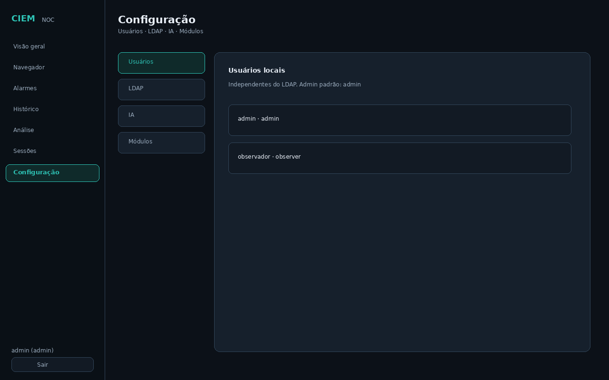
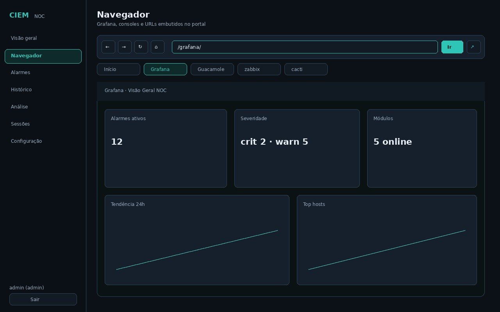
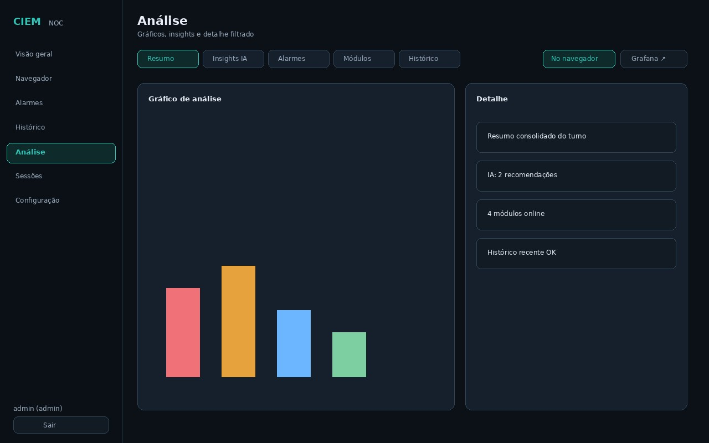

# Manual do administrador

Guia para quem **configura e opera** o CIEM: usuários, LDAP, módulos, IA, sessões Guacamole e auditoria.

| Credencial de desenvolvimento | Valor |
|-------------------------------|-------|
| Usuário | `admin` |
| Senha | `admin123` |

**Altere a senha em produção.** Manual do observer: [MANUAL_USER.md](MANUAL_USER.md).

## Papel admin

Além de tudo que o observer vê, o admin acessa:

| Item da sidebar | Função |
|-----------------|--------|
| **Navegador** | Igual ao observer + Guacamole SSO embutido e URLs dos módulos |
| **Sessões** | SSO Guacamole + auditoria (abrir no navegador ou em nova aba) |
| **Configuração** | Usuários · LDAP · IA · Módulos |

## Login e alteração de senha

1. Login em `/` com `admin`  
2. Sidebar **Configuração → Usuários**  
3. Em `admin` → **Alterar senha**  


Detalhes de autenticação: [AUTH.md](AUTH.md).

## Configuração por seções



A Configuração usa seções laterais (uma tarefa por vez).

### 1. Usuários locais

- Criar usuário (`observer` ou `admin`)  
- Alterar senha / habilitar / desabilitar / excluir  
- O **último admin** não pode ser excluído  
- Usuários locais têm prioridade sobre LDAP  

### 2. LDAP / Active Directory (opcional)

- Habilitar e preencher host, porta, SSL, domínio, Base DN, UID, filtros, bind e certificados  
- Com LDAP ativo, o login tenta local e depois o diretório  
- O admin padrão local continua válido  

Campos e YAML: [AUTH.md](AUTH.md).

### 3. Inteligência Artificial

- Somente admin configura URL, API key, modelo e opções  
- Com a função **habilitada**, insights ficam visíveis a **todos** (Visão geral + Análise)  
- Botão **Gerar insights agora** força refresh  
- Sem API key ou falha do provedor → heurística local  

Guia: [AI.md](AI.md).

### 4. Módulos coletores

- Switch ON/OFF por módulo  
- Com ON, aparece o formulário (URL, credenciais, opções)  
- **Salvar** grava em `config/modules.yaml`  

Guia: [MODULES.md](MODULES.md).

## Navegador HTML5 (admin)

Além do Grafana e URLs, o admin usa o **Navegador** para:

- **Guacamole** via SSO (chip Guacamole ou Sessões → **No navegador**)  
- Consoles dos módulos com `options.url` preenchida  



O mockup mostra o item **Navegador** na sidebar (sem restrição de papel), chrome completo e atalhos Grafana / Guacamole / módulos.

## Sessões de manutenção


1. Sidebar **Sessões**  
2. Em cada alvo: **No navegador** (iframe do portal) ou **Nova aba ↗**  
3. Ou **Abrir Guacamole ↗** / **No navegador** no cabeçalho  
4. SSO abre a sessão **sem novo login**; a auditoria registra usuário, alvo, protocolo e horários  

Guia técnico: [GUACAMOLE.md](GUACAMOLE.md) · [MAINTENANCE.md](MAINTENANCE.md).

## Visão operacional

Use **Visão geral**, **Navegador**, **Alarmes**, **Histórico** e **Análise** para operar o NOC — o mesmo fluxo do observer, com acesso total.




## Checklist pós-implantação

- [ ] Alterar senha do `admin`  
- [ ] Criar usuários locais necessários  
- [ ] (Opcional) Configurar LDAP  
- [ ] Ativar módulos e validar cards “online”  
- [ ] (Opcional) Ativar IA e gerar insights  
- [ ] Validar Grafana no **Navegador** e em `/grafana/`  
- [ ] Validar um alvo em Sessões (**No navegador** e nova aba)  

## APIs úteis

```bash
# Login
curl -s -X POST https://ciem.exemplo.local/api/auth/login \
  -H 'Content-Type: application/json' \
  -d '{"username":"admin","password":"admin123"}'

# Status dos módulos
curl -s -H "Authorization: Bearer <token>" \
  https://ciem.exemplo.local/api/modules/status

# Alarmes ativos
curl -s -H "Authorization: Bearer <token>" \
  https://ciem.exemplo.local/api/alarms/active
```

## Problemas comuns

| Sintoma | Ação |
|---------|------|
| Não exclui `admin` | Crie outro admin antes |
| Módulo offline | Revisar URL/credenciais na seção Módulos |
| Insights vazios | Conferir API key/modelo; usar “Gerar agora” |
| Guacamole 403 | Confirme papel admin e alvos em `targets.yaml` |
| SSO com URL quebrada | Abrir `login_url` sem prefixar `/api` de novo |

Ver também: [CONFIGURATION.md](CONFIGURATION.md) · [USAGE.md](USAGE.md) · [PORTAL.md](PORTAL.md) · [CHANGELOG_FEATURES.md](CHANGELOG_FEATURES.md)
