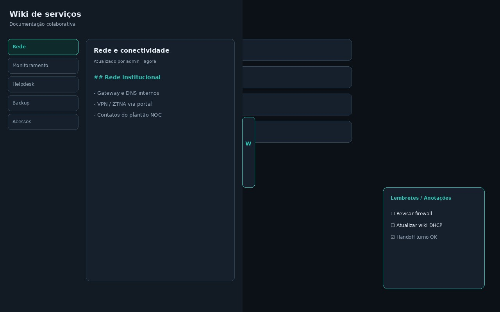

# Portal CIEM — guia visual e de desenvolvimento

O portal (`services/portal/`) é uma SPA estática servida pelo proxy em `/`. Use os mockups abaixo para alinhar UX, produto e desenvolvimento.

## Interface atual (ergonomia NOC)

Layout com **sidebar** à esquerda e **workspace** à direita:

- Tipografia: DM Sans + IBM Plex Mono  
- Tema escuro NOC com accent teal  
- Login brand-first (marca CIEM em destaque)  
- Espaço dedicado a **KPIs**, **gráficos** e **insights**  

### Login


- Campos: usuário e senha  
- Autenticação: `POST /api/auth/login` → token Bearer em `localStorage`  
- Aceita usuários locais e LDAP (se habilitado)  
- Erros exibidos abaixo do formulário  

### Visão geral (dashboard)


- Chip de alarmes ativos no cabeçalho (atalho para Alarmes)  
- **KPIs**: críticos, warnings, total de alarmes, módulos online  
- **Gráfico de severidade** (canvas) + legenda  
- **Insights** (preview; abre Análise completa)  
- Grade de **coletores** com status online/indisponível/desabilitado  
- Dados: `GET /api/modules/status`, `GET /api/alarms/active`, `GET /api/insights`  
- Atalho **Abrir navegador** (Grafana embutido)
- **Lembretes** flutuantes (arrastáveis, persistidos no navegador)
- Aba lateral **Calendário** (deslizante) com Google Calendar e/ou Microsoft Outlook via URL de incorporação

### Lembretes / Anotações (flutuante, arrastável)

Painel compacto sobre o workspace (visível após o login):

- Arraste pelo título para reposicionar; posição salva em `localStorage`
- Adicionar, concluir e remover itens (lembretes ou anotações curtas do turno)
- Recolher ou ocultar (botão **Lembretes** reabre)
- Dados locais ao navegador — não vão para o servidor

### Calendário (aba deslizante à direita)

Aba vertical **Calendário** ou botão no cabeçalho:

- Abre gaveta deslizante com transição suave e backdrop
- Provedores: **Google** e **Microsoft** (iframe de calendário publicado/compartilhado)
- Aba **Configurar**: cole a URL pública de incorporação
- Apenas URLs `https` de domínios Google/Outlook são aceitas
- Esc ou **Fechar** fecha a gaveta

### Wiki de serviços (aba deslizante à esquerda)

Aba vertical **Wiki** ou botão **Wiki** no cabeçalho:

- Documentação colaborativa dos serviços da instituição (Markdown)
- Qualquer usuário autenticado lê e edita; exclusão de páginas é só admin
- Persistência em `config/wiki.yaml` via `GET/PUT/POST/DELETE /api/wiki…`
- Lista de páginas + visualização / edição sem sair do dashboard
- Esc ou **Fechar** fecha a gaveta (não abre junto com o calendário)


### Navegador HTML5 (todos os papéis)


Painel full-bleed com chrome de browser, disponível **desde o login** para observer e admin:

- Controles: voltar, avançar, recarregar, início, barra de URL, abrir em nova aba (↗)  
- Atalhos (chips): Início, Grafana; admin: Guacamole (SSO) e `options.url` dos módulos habilitados  
- Página inicial com cartões de destino; URLs recentes em `localStorage`  
- Destinos same-origin (`/grafana/`, SSO Guacamole) embutem no iframe; externos podem exigir nova aba  
- Atalho de teclado: Ctrl/Cmd+L foca a barra de endereço  

### Alarmes ativos


- Lista agregada de todos os módulos habilitados  
- Severidade destacada: critical / high / warning / info  
- Endpoint: `GET /api/alarms/active`  

### Análise (todos os papéis)


Painel com abas segmentadas e área ampla para gráfico + detalhe:

| Aba | Conteúdo |
|-----|----------|
| Resumo | KPIs + visão consolidada + status de IA |
| Insights IA | Resumo, cards e gráficos sugeridos (se habilitado) |
| Alarmes | Distribuição de severidade + lista |
| Módulos | Saúde dos coletores |
| Histórico | Volume por fonte + eventos |
| Sessões | Auditoria (somente admin) |

Link Grafana: preferir o painel **Navegador**; também há atalho **No navegador** / **Grafana ↗** nesta toolbar.

### Sessões de manutenção (admin)


- Botão **No navegador** — SSO Guacamole no iframe do portal  
- Botão **Abrir Guacamole ↗** — SSO em nova aba (`POST /api/sso/guacamole`)  
- Lista de alvos com **No navegador** e **Nova aba ↗**  
- Auditoria: `GET /api/sessions/audit`  

### Configuração (admin)

Navegação lateral em seções (uma tarefa por vez):

1. **Usuários** — CRUD local; admin padrão marcado; alterar senha / habilitar / excluir  
2. **LDAP** — apontamentos opcionais (host, porta, SSL, bind, filtros, certificados)  
3. **Inteligência Artificial** — provedor, URL, API key, modelo; **Gerar insights agora**  
4. **Módulos** — switch por coletor; com ON, formulário de URL/credenciais e salvar  

Persistência: `config/auth.yaml`, `config/ai.yaml`, `config/modules.yaml`.

## Navegação

| Item da sidebar | Papel | Função |
|-----------------|-------|--------|
| Visão geral | Todos | KPIs, gráfico, insights, coletores |
| Navegador | Todos | Browser HTML5 (Grafana, URLs; admin: Guacamole/módulos) |
| Alarmes | Todos | Problemas em andamento |
| Histórico | Todos | Últimos eventos agregados |
| Análise | Todos | Gráficos + detalhe filtrado + insights |
| Sessões | Admin | Guacamole + auditoria |
| Configuração | Admin | Usuários, LDAP, IA, módulos |
| Sair | Todos | Remove token e volta ao login |

## Papéis

| Papel | O que vê |
|-------|----------|
| **observer** | Visão geral, Navegador, Alarmes, Histórico, Análise (incl. insights se ativos) |
| **admin** | Tudo + Sessões + Configuração completa |

## Estrutura do código

```
services/portal/public/
├── index.html      # Layout (login + sidebar + painéis)
├── css/style.css   # Tema escuro NOC / ergonomia
└── js/portal.js    # API client, auth, gráficos, config
```

## Desenvolvimento e versionamento

1. **Branch** — `cursor/portal-<descricao>` ou fluxo do time  
2. **Mockup** — se a UI mudar de forma visível, atualize o JPG em `docs/assets/`  
3. **PR** — inclua screenshot ou diff do mockup  
4. **Teste manual** — login com `admin` / `admin123`  

### Checklist de PR (portal)

- [ ] Login e logout funcionam  
- [ ] Observer vê **Navegador** e não vê Sessões nem Configuração  
- [ ] Navegador: Grafana embute; ↗ abre externa; Ctrl/Cmd+L foca URL  
- [ ] Chip de alarmes reflete contagem real  
- [ ] Análise: abas e gráfico renderizam  
- [ ] SSO Guacamole abre no navegador ou em nova aba sem duplicar `/api`  
- [ ] Configuração: usuários, LDAP, módulos (switch+opções), IA  
- [ ] Insights visíveis ao observer quando IA habilitada  
- [ ] Mockups atualizados em `docs/assets/` (incl. `ciem-portal-browser.jpg` se UI do browser mudar)  

## Customização

| Item | Onde alterar |
|------|----------------|
| Cores / fontes | `services/portal/public/css/style.css` |
| Textos e painéis | `services/portal/public/index.html` |
| Chamadas API | `services/portal/public/js/portal.js` |
| Nome da plataforma | `config/main.yaml` |

## Limitações atuais

- Bind LDAP em runtime pode depender do ambiente; apontamentos são persistidos (ver [AUTH.md](AUTH.md))  
- Coleta periódica depende do agendador ([PROCESSES.md](PROCESSES.md)); o portal consulta sob demanda  
- API keys de IA não devem ser versionadas em repositório público  

Documentação relacionada: [AUTH.md](AUTH.md) · [AI.md](AI.md) · [MODULES.md](MODULES.md) · [USAGE.md](USAGE.md)
