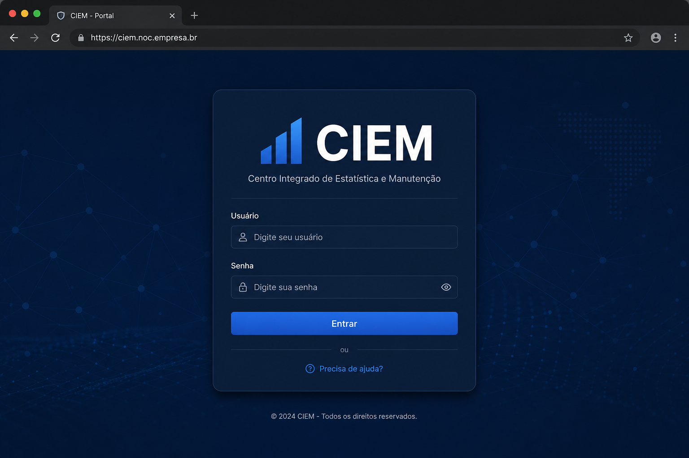
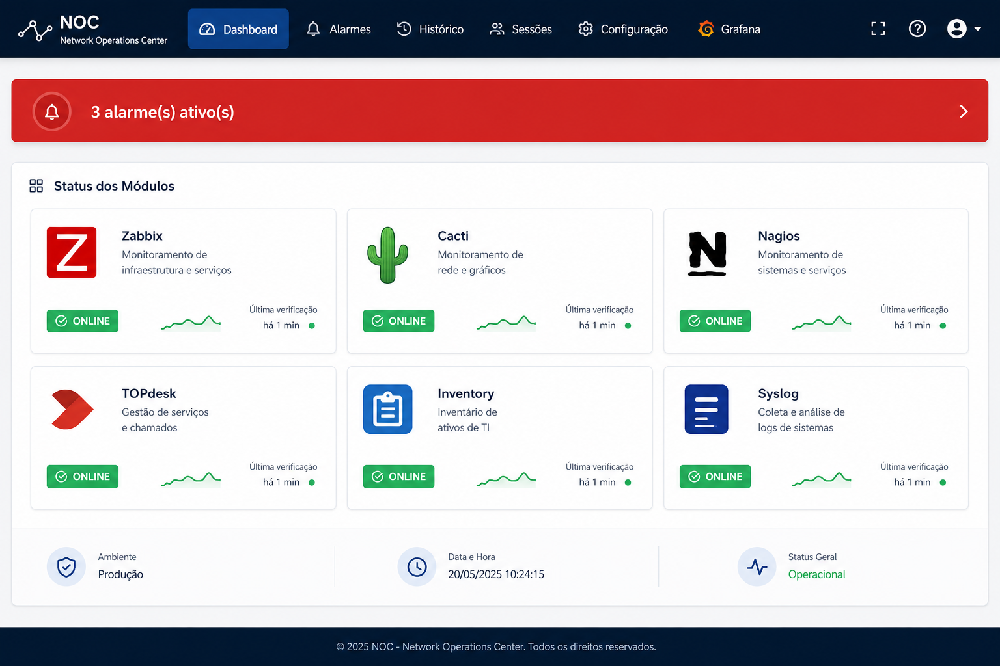
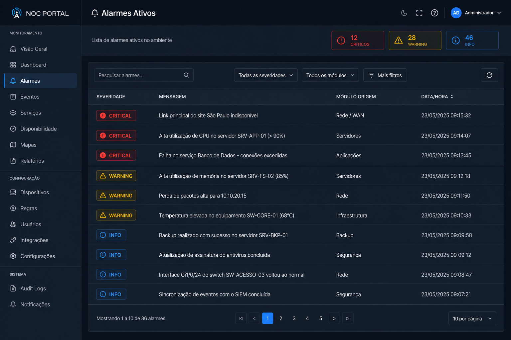
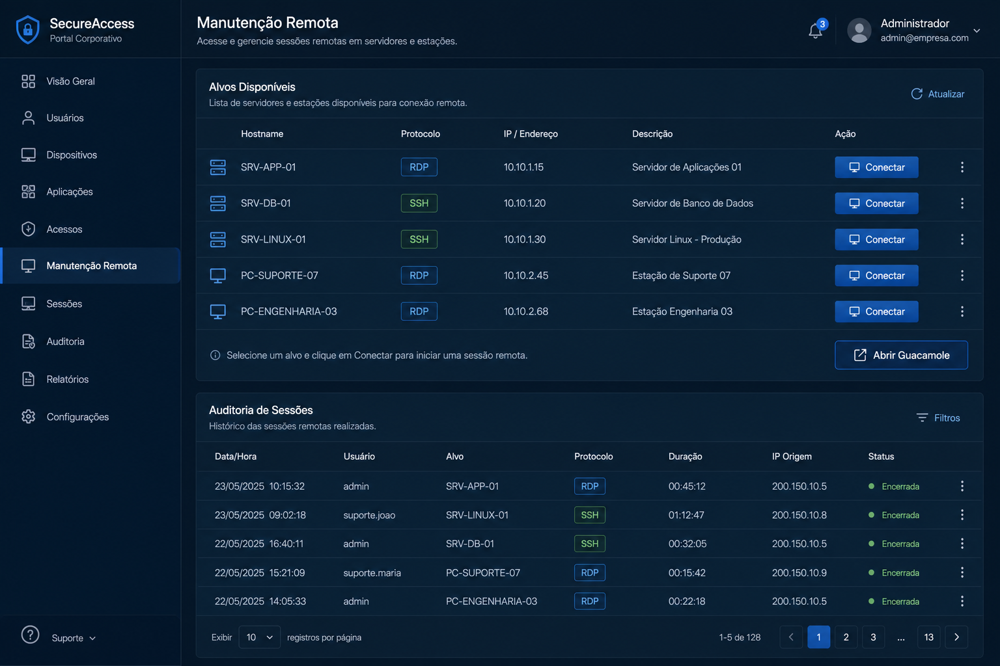

# Portal CIEM — guia visual e de desenvolvimento

O portal (`services/portal/`) é uma SPA estática servida pelo proxy em `/`. Use os mockups abaixo para alinhar UX, produto e desenvolvimento entre times.

## Mockups (referência visual)

### Login



- Campos: usuário e senha  
- Autenticação: `POST /api/auth/login` → token Bearer em `localStorage`  
- Erros exibidos abaixo do formulário  

### Dashboard — visão geral



- Banner vermelho quando há alarmes ativos (link para painel Alarmes)  
- Grade de módulos: status **ONLINE** / **OFFLINE**, última coleta  
- Dados: `GET /api/modules/status`, `GET /api/alarms/active`  

### Alarmes ativos



- Lista agregada de todos os módulos habilitados  
- Severidade: `critical`, `warning`, `info`  
- Endpoint: `GET /api/alarms/active`  

### Sessões de manutenção (admin)



- Botão **Abrir Guacamole** — SSO sem novo login  
- Lista de alvos de `config/targets.yaml` com **Conectar** por alvo  
- Auditoria: `GET /api/sessions/audit`  

## Navegação

| Aba | Papel | Função |
|-----|-------|--------|
| Dashboard | Todos | Status dos módulos + resumo de alarmes |
| Alarmes | Todos | Problemas em andamento |
| Histórico | Todos | Últimos 50 eventos agregados |
| Sessões | Admin | Guacamole + auditoria |
| Configuração | Admin | Visualização de módulos (edição via YAML) |
| Grafana | Todos | Abre `/grafana/` em nova aba |
| Sair | Todos | Remove token e volta ao login |

## Papéis

| Papel | O que vê |
|-------|----------|
| **observer** | Dashboard, Alarmes, Histórico, Grafana |
| **admin** | Tudo + Sessões + Configuração |

## Estrutura do código

```
services/portal/public/
├── index.html      # Layout e painéis
├── css/style.css   # Tema escuro NOC
└── js/portal.js    # API client, auth, renderização
```

## Desenvolvimento e versionamento

1. **Branch** — use `feature/portal-<descricao>` ou o fluxo do time  
2. **Mockup** — se a UI mudar de forma visível, atualize o JPG em `docs/assets/`  
3. **PR** — inclua screenshot ou diff do mockup na descrição  
4. **Teste manual** — login com `admin` / `admin123` no profile `core`  

### Checklist de PR (portal)

- [ ] Login e logout funcionam  
- [ ] Observer não vê abas admin  
- [ ] Banner de alarmes reflete contagem real  
- [ ] Links Grafana e Guacamole abrem com SSO (admin)  
- [ ] Mockup atualizado em `docs/assets/` (se aplicável)  

## Customização

| Item | Onde alterar |
|------|----------------|
| Cores / fontes | `services/portal/public/css/style.css` |
| Textos e painéis | `services/portal/public/index.html` |
| Chamadas API | `services/portal/public/js/portal.js` |
| Nome da plataforma | `config/main.yaml` → `platform_name` |

## Limitações atuais

- Configuração de módulos é **somente leitura** no portal — edite `config/modules.yaml` e reinicie os pods/containers  
- Coleta não é disparada automaticamente pelo portal — ocorre sob demanda (ver [PROCESSES.md](PROCESSES.md))  
