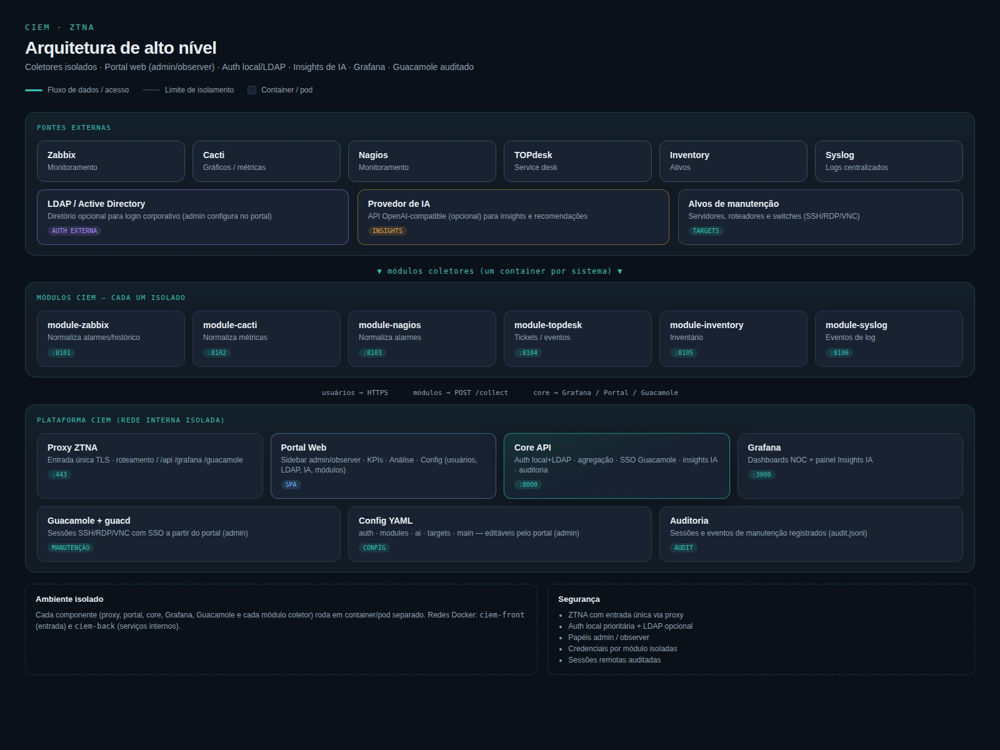

# Processos e fluxos de execução — CIEM

Descrição dos processos de ponta a ponta: coleta, alarmes, visualização e manutenção remota.

## Diagrama geral



O diagrama destaca o **Portal Web + Navegador HTML5** (Grafana / URLs / SSO Guacamole) atrás do proxy ZTNA. Mockup da tela: [ciem-portal-browser.jpg](assets/ciem-portal-browser.jpg).

## 1. Autenticação no portal

```
Usuário → POST /api/auth/login {username, password}
       → Core tenta usuários locais (config/auth.yaml, PBKDF2)
       → Se falhar e LDAP enabled → tenta diretório
       → Retorna token Bearer
       → Portal armazena e envia em Authorization
```

| Papel | Escopo |
|-------|--------|
| observer | Leitura: módulos, alarmes, histórico, **Navegador HTML5**, insights IA (se ativo) |
| admin | + sessões, config (usuários, LDAP, módulos, IA), SSO Guacamole (navegador ou nova aba) |

Admin padrão `admin` autentica **sempre** via usuário local, independente do LDAP. Detalhes: [AUTH.md](AUTH.md).

## 2. Coleta de dados (módulos)

A coleta é **sob demanda** — disparada quando alguém ou algo consulta alarmes/histórico.

Admin habilita módulos e opções em **Configuração** (grava `config/modules.yaml`).

```
Cliente (portal, Grafana, API)
    → GET /api/alarms/active  ou  POST /api/modules/{nome}/collect
    → Core (aggregators.py)
    → Para cada módulo enabled em modules.yaml:
           POST http://module-{nome}:8080/collect
    → Módulo consulta sistema externo (Zabbix API, etc.)
    → Retorna JSON normalizado (active_alarms, history_events)
    → Core agrega, ordena por severidade/timestamp
```

### Formato normalizado (resumo)

```json
{
  "module": "zabbix",
  "status": "ok",
  "active_alarms": [
    {
      "id": "...",
      "severity": "critical",
      "message": "...",
      "source": "zabbix",
      "timestamp": "2026-09-01T12:00:00+00:00"
    }
  ],
  "history_events": []
}
```

### Quem dispara coleta

| Gatilho | Quando |
|---------|--------|
| Abrir aba Alarmes/Histórico no portal | A cada carregamento |
| Scrape `/metrics` | Atualiza gauges Prometheus |
| Painéis Grafana (Infinity) | Refresh do dashboard |
| `POST /api/modules/{nome}/collect` | Manual / automação |

> `collection_interval_seconds` em `main.yaml` documenta o intervalo desejado para futuro agendador; hoje a coleta não é periódica em background.

## 3. Exibição de alarmes

```
Alarmes ativos  → portal / Grafana / Prometheus
Histórico       → separado (eventos resolvidos ou informativos)
```

**Regra de negócio:** alarmes ativos aparecem em destaque (banner no portal, topo no NOC Grafana).

## 4. Sessão de manutenção (Guacamole + SSO)

### Fluxo SSO (recomendado — via portal)

```
Admin clica "Conectar" no alvo
    → POST /api/sso/guacamole {target_id}
    → Core gera token HMAC + URL /api/sso/guacamole/login?token=...
    → Navegador define cookie ciem_sso
    → Redireciona para /guacamole/
    → Nginx auth_request → GET /api/sso/validate
    → Guacamole abre conexão provisionada em targets.yaml
```

### Provisionamento Guacamole

Na inicialização do container `guacamole`:

1. Lê `config/targets.yaml`  
2. Gera `user-mapping.xml` e propriedades de extensão  
3. Cria conexões SSH/RDP/VNC por alvo  

### Auditoria

```
Admin encerra sessão (ou timeout)
    → POST /api/sessions/end
    → Append em audit_log_path (JSON Lines)
    → Portal/Grafana exibem via /api/sessions/audit
```

Campos típicos: usuário, alvo, início, fim, duração, protocolo.

## 5. Publicação de métricas

```
Prometheus/Grafana scrape GET /api/metrics
    → Core atualiza gauges (alarmes, módulos up, sessões)
    → Dashboards CIEM-Prometheus refletem valores
```

## 6. Insights de Inteligência Artificial

```
Admin → Configuração → IA (URL, API key, modelo) → PUT /api/config/ai
     → grava config/ai.yaml; limpa cache de insights

Qualquer usuário autenticado → GET /api/insights
     → se disabled: status disabled
     → se enabled: cache ou chamada ao provedor (OpenAI-compatible)
     → fallback heurístico se sem key / erro do provedor
     → portal (aba Insights IA) e Grafana (/grafana/insights*)
```

Configuração apenas admin; resultados públicos quando habilitado. Detalhes: [AI.md](AI.md).

## 7. Deploy e atualização (CI/CD)

```
git push main
    → GitHub Actions CI: ruff + pytest + docker build
    → GitHub Actions CD: push imagens ghcr.io/avilarezende/ciem-*
    → Kubernetes: kubectl set image ... ou ArgoCD/Flux
    → rollout restart se ConfigMap mudou
```

## 8. Checklist operacional

### Após deploy

- [ ] `/api/health` retorna 200  
- [ ] Todos os módulos habilitados **ONLINE** no dashboard  
- [ ] Grafana pasta CIEM com 13 dashboards (incl. `ciem-insights`)  
- [ ] Login `admin` → alterar senha em Configuração  
- [ ] (Opcional) LDAP e IA configurados pelo portal  
- [ ] Teste SSO Guacamole com usuário admin  
- [ ] Entrada de auditoria em `sessions.jsonl`  

### Após mudança em `config/`

- [ ] Reiniciar `ciem-core` se YAML foi editado fora do portal  
- [ ] Reiniciar módulos afetados se o coletor só lê YAML no boot  
- [ ] Reiniciar `guacamole` se `targets.yaml` mudou  
- [ ] Validar coleta: `POST /api/modules/{nome}/collect`  
- [ ] Se IA ativa: `GET /api/insights` retorna habilitado  

## Referências

- [USAGE.md](USAGE.md) — operações no portal  
- [AUTH.md](AUTH.md) — usuários locais e LDAP  
- [AI.md](AI.md) — provedores e insights  
- [CHANGELOG_FEATURES.md](CHANGELOG_FEATURES.md) — novidades do portal  
- [GUACAMOLE.md](GUACAMOLE.md) — SSO e targets  
- [MODULES.md](MODULES.md) — detalhe por coletor  
- [KUBERNETES.md](KUBERNETES.md) — rollout em pods  
